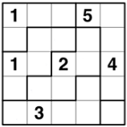

# Suguru Solver



## Objetivo

O objetivo do trabalho é desenvolver um resolvedor do puzzle **Suguru** em **Haskell**.

## Regras do Jogo

* O Suguro é um *puzzle* de tabuleiro, composto por uma **matriz quadrada *nxn* de qualquer tamanho**.
* A matriz é **dividida em grupos** e os **grupos são formados por células**. As células são equivalentes a um **elemento da matriz**
* Um grupo de *N* células deve, **obrigatoriamente, conter os números de 1 a *N***.
* Se uma célula possui um valor *m*, **todas as células adjacentes não podem conter o mesmo valor**.

## Visão Geral do Sistema

### Compilação e Execução

* Compile o programa com: `ghc --make main.hs`.
* Execute com: `./main`.

```
ghc --make main.hs && ./main
```


* O "Tabuleiro é composto por"

* Toda posição *p* armazena uma lista de possiveis valores;

* O tamanho dessa lista, inicialmente, só depende do número de posições *p* que existem na região *r* em que a posição *p* está inserida.
Ex: Posição c/ três posições tem um vetor de possiveis valores = [1,2,3]

* Algumas posições já vem pré-preenchidas. Se isso é o caso, a lista de possíveis valores p/ aquela posição irá armazenar apenas o valor contido em *p*
Ex: `posicao[0][0].possiveis_valores = [2]`

* Com essas duas informações, já é possível iterar por todas as regiões, excluindo p/ cada posição o valor que já está presente na região.

* Sabemos que se o valor *v* ocupa a posição *p*, **nenhum dos adjacentes a p pode conter o mesmo valor** .

* Com essa informação, podemos iterar por todas as posições das quais só existe um possível valor e excluir das posições adjacentes esse valor


"Nessa região eu tenho 5 posições no total, 4 não contem o 5 então, o 5 deve ser na posição que ainda o possui"

P/ todas as posições da região. se somente houver uma posição que pode conter o valor v então essa é a região que o contém.

Se alguma das posições forem preenchidas, retiramos o valor preenchido da lista de possiveis valores das posições adjacentes


Olhe para todos os lugares que um número pode aparecer em uma região. P/ qualquer posição que é adjacente a todas as posições, essa posição não pode conter o número em questão.

Se o tamanho da região é igual a 1 então, orbigatoriamente ele tem o valor 1


1. Preencher tabuleiro com os primeiros valores
2. Preencher todas as posições com seus possíveis valores:
for posicao in regiao
    for i in len(regiao):
        if i not in regiao
            posicao.valores_possiveis.append(i)

3. P/ todas as posicoes, se len(posicao.valores_possiveis) = 1 eu achei meu valor
for regiao in jogo
    for posicao in regiao
        if len(posicao.valores_possiveis) == 1:
            valor da posicao = posicao.valores_possiveis[0]
            # se eu achei meu valor, eu preciso excluir esse valor de todos os adjacentes
4. p cada regiao, verificar se algum valor está só em uma posição, se isso acontecer, eu achei meu valor e novamente eu preciso excluir esse valor de todos os adjacentes


1. Preencher tabuleiro com os primeiros valores
2. Preencher tabuleiro com todos os valores possiveis
3. p cada posicao c/ valor estabelecido, remover o valor dos adjacentes
4. P/ cada possivel valor de cada posicao de cada regiao, verificar se ele é possível valor de somente uma posição. Caso positivo, ele é o valor daquela posição (já remove os adjacentes que podem ter esse valor)
5. Se valores possíveis = 1, então esse é o valor

OBS quando eu acho um valor, eu devo excluir esse valor dos possiveis valores dos adjacentes e de todos da regiao
